## BUILDING SPTINGBOOT MICROSERVICE USING CLOUD - [NEXT>>](Part_02_Spring_Boot_Microservices_Inter_Service_Communication.md)

### TABLE OF CONTENTS

- [01 - Introduction](#introduction)
- [02 - Solution Architecture of Microservices](#solution-architecture-of-microservices)
- [03 - Logical Architecture of Services](#logical-architecture-of-services)
- [04 - Create A Microservice](#create-a-microservice)
- [05 - Implement Product Service](#implement-product-service)
- [06 - Manual Testing through Postman](#manual-testing-through-postman)
- [07 - Implement Automated Tests](#implement-automated-tests)
- [08 - Test Containers](#test-containers)
- [09 - Write Integration Tests](#write-wntegration-tests)
- [10 - Generate Order Service](#generate-order-service)
- [11 - Implement Order Service](#implement-order-service)
- [12 - Test Order Service](#test-order-service)
- [13 - Generate Inventory Service](#generate-inventory-service)
- [14 - Implement Inventory Service](#implement-inventory-service)
- [15 - Migrate to Maven Multi-Module Project](#migrate-to-maven-multi-module-project)
- [16 - Bugfix in Inventory Service](#bugfix-in-inventory-service)

### Introduction

Spring Cloud provides tools for developers to quickly build some of the common patterns in distributed systems (e.g. configuration management, service discovery, circuit breakers, intelligent routing, micro-proxy, control bus, short lived microservices and contract testing). Coordination of distributed systems leads to boiler plate patterns, and using Spring Cloud developers can quickly stand up services and applications that implement those patterns. They will work well in any distributed environment, including the developer’s own laptop, bare metal data centres, and managed platforms such as Cloud Foundry.

- **Features**:
   - Spring Cloud focuses on providing good out of box experience for typical use cases and extensibility mechanism to cover others.
   - Distributed/versioned configuration
   - Service registration and discovery
   - Routing
   - Service-to-service calls
   - Load balancing
   - Circuit Breakers
   - Distributed messaging
   - Short lived microservices (tasks)
   - Consumer-driven and producer-driven contract testing

### Solution Architecture of Microservices

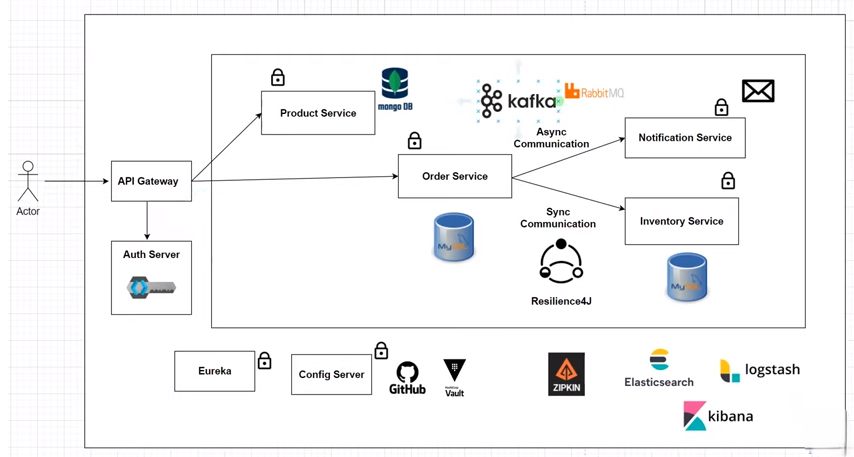

### Logical Architecture of Services

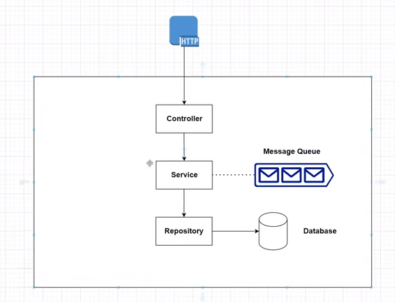

### Create A Microservice

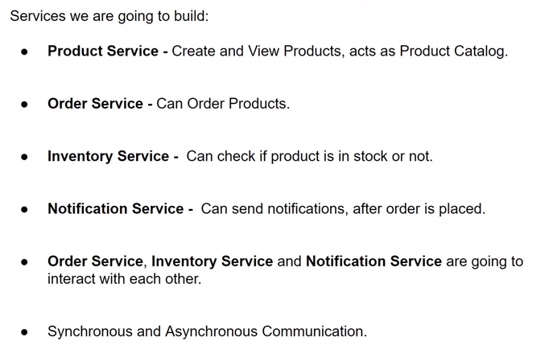

The application module is the main module of the project. It contains the application class in which the main method is defined that is necessary to run the Spring Boot Application. It also contains application configuration properties, Controller, views, and resources.

The Application Module includes Model Module, Service Implementation Module as dependency that contains Model Module, Repository Module, and Service API module.

- Product-Service
This module will handle all functionalities related to products such as adding, updating, and retrieving products.
- Order-Service
This module will handle all functionalities related to orders such as placing orders, updating orders, and retrieving orders.
- Inventory-Service
This module will handle all functionalities related to inventory such as adding new items to inventory, updating inventory levels, and retrieving inventory information.

### Generate Product Service

- 1. product-service Module

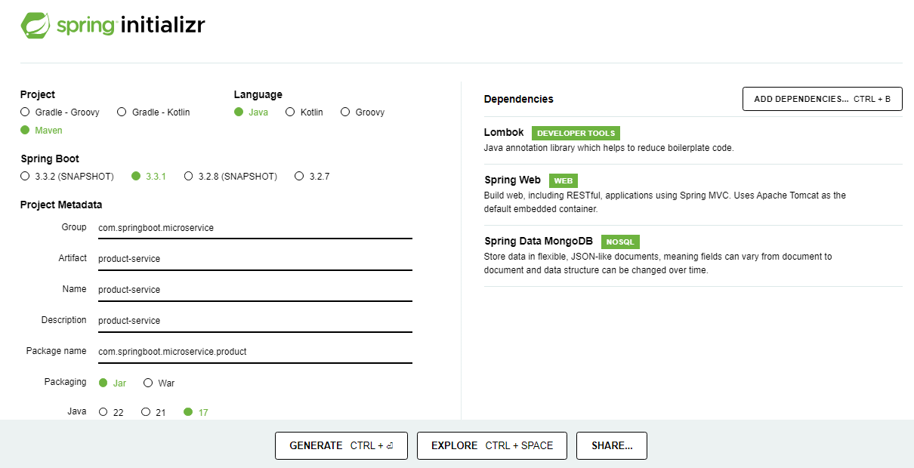

The Model Module contains Entities and Visual Objects to be used in the project.

Spring Boot Project Structure
``` 
product-service
├── src
│   ├── main
│   │   ├── java
│   │   │   └── com
|   |   |       └── springboot
|   |   |           └── microservice
|   |   |               └── product
|   |   |                   ├── ProductServiceApplication.java
|   |   |                   ├── controller
|   |   |                   |   └── ProductController.java
|   |   |                   ├── dto
|   |   |                   |   └── ProductRequest.java
|   |   |                   |   └── ProductResponse.java
│   │   │                   ├── model
│   │   │                   │   └── Product.java
|   |   |                   ├── service
|   |   |                   |   └── ProductService.java
|   |   |                   └── repository
|   |   |                       └── ProductRepository.java
|   |   └── resources
|   |       ├── application.properties
|   |       ├── static
|   |       ├── templates
|   |       └── META-INF
|   |           └── MANIFEST.MF
|   └── src
|       ├── test
|       │   ├── java
|       │   │   └── com
|       │   │       └── springboot
|       │   │           └── microservice
|       │   │               └── product
|       │   │                   └── ProductServiceApplicationTest.java
|       └── resources
|           └── application.properties
└── pom.xml
```

### Implement Product Service

In this structure:

ProductServiceApplication.java is the main class that contains the main method to run the Spring Boot application.
```java
package com.springboot.microservice;

import org.springframework.boot.SpringApplication;
import org.springframework.boot.autoconfigure.SpringBootApplication;

@SpringBootApplication
public class ProductServiceApplication {

	public static void main(String[] args) {
		SpringApplication.run(ProductServiceApplication.class, args);
	}
}
```
controller package contains the ProductController class with mapping endpoints.

```java
package com.springboot.microservice.controller;

import com.springboot.microservice.dto.ProductRequest;
import com.springboot.microservice.dto.ProductResponse;
import com.springboot.microservice.service.ProductService;
import lombok.RequiredArgsConstructor;
import org.springframework.http.HttpStatus;
import org.springframework.web.bind.annotation.*;

import java.util.List;

@RestController
@RequestMapping("/api/product")
@RequiredArgsConstructor
public class ProductController {

    private final ProductService productService;

    @PostMapping
    @ResponseStatus(HttpStatus.CREATED)
    public void createProduct(@RequestBody ProductRequest productRequest) {
        productService.createProduct(productRequest);
    }

    @GetMapping
    @ResponseStatus(HttpStatus.OK)
    public List<ProductResponse> getAllProducts() {
        return productService.getAllProducts();
    }
}
```
service package contains the service classes which contain business logic.
```java

package com.springboot.microservice.service;

import com.springboot.microservice.dto.ProductRequest;
import com.springboot.microservice.dto.ProductResponse;
import com.springboot.microservice.model.Product;
import com.springboot.microservice.repository.ProductRepository;
import lombok.RequiredArgsConstructor;
import lombok.extern.slf4j.Slf4j;
import org.springframework.stereotype.Service;
import java.util.List;

@Service
@RequiredArgsConstructor
@Slf4j
public class ProductService {

    private final ProductRepository productRepository;

    public void createProduct(ProductRequest productRequest) {
        Product product = Product.builder()
                .name(productRequest.name())
                .description(productRequest.description())
                .price(productRequest.price())
                .build();

        productRepository.save(product);
        log.info("Product {} is saved", product.getId());
    }

    public List<ProductResponse> getAllProducts() {
        List<Product> products = productRepository.findAll();

        return products.stream().map(this::mapToProductResponse).toList();
    }
    // for lombok version
    /*private ProductResponse mapToProductResponse(Product product) {
        return new ProductResponse.builder()
			.id(product.getId())
			.name(product.getName())
			.description(product.getDescription())
			.price(product.getPrice())
			.build();
    }*/
    // for record version -replaced
    private ProductResponse mapToProductResponse(Product product) {
        return new ProductResponse(product.getId(), product.getName(),
                product.getDescription(), product.getPrice());
    }
}
```
repository package contains the repository classes that interact with the database.

```java
package com.springboot.microservice.repository;

import com.springboot.microservice.model.Product;
import org.springframework.data.mongodb.repository.MongoRepository;

public interface ProductRepository extends MongoRepository<Product, String> {
}
```
model package contains the model classes that interact with the MongoDB database.

```java
package com.springboot.microservice.model;

import lombok.AllArgsConstructor;
import lombok.Builder;
import lombok.Data;
import lombok.NoArgsConstructor;
import org.springframework.data.annotation.Id;
import org.springframework.data.mongodb.core.mapping.Document;

import java.math.BigDecimal;

@Document(value = "product")
@AllArgsConstructor
@NoArgsConstructor
@Builder
@Data
public class Product {

    @Id
    private String id;
    private String name;
    private String description;
    private BigDecimal price;
}
```
dto package contains the request and response dto classes that interact with the database.

ProductRequest.java

- version-1: based on lombok
```java
package com.springboot.microservice.dto;

import lombok.AllArgsConstructor;
import lombok.Builder;
import lombok.Data;
import lombok.NoArgsConstructor;

import java.math.BigDecimal;

@AllArgsConstructor
@NoArgsConstructor
@Builder
@Data
public class ProductRequest {
    private String name;
    private String description;
    private BigDecimal price;
}
```
- version-2: based on record

```java
package com.springboot.microservice.dto;

import java.math.BigDecimal;

public record ProductRequest(String name, String description, BigDecimal price) {
}
```
ProductResponse.java

- version-1: based on lombok
```java
package com.springboot.microservice.dto;

import lombok.AllArgsConstructor;
import lombok.Builder;
import lombok.Data;
import lombok.NoArgsConstructor;

import java.math.BigDecimal;

@AllArgsConstructor
@NoArgsConstructor
@Builder
@Data
public class ProductResponse {
    private String id;
    private String name;
    private String description;
    private BigDecimal price;
}
```
- version-2: based on record
```java
package com.springboot.microservice.dto;

import java.math.BigDecimal;

public record ProductResponse(String id, String name, String description, BigDecimal price) {
}
```
application.properties contains application-specific properties.
```properties
#MongoDB database congfiguration
spring.data.mongodb.uri=mongodb://localhost:27017/product-service
```
static directory contains static resources like Javascript, CSS, etc.

templates directory contains HTML templates for the application.

META-INF directory contains the manifest file.

pom.xml:
```pom
<?xml version="1.0" encoding="UTF-8"?>
<project xmlns="http://maven.apache.org/POM/4.0.0" xmlns:xsi="http://www.w3.org/2001/XMLSchema-instance"
  xsi:schemaLocation="http://maven.apache.org/POM/4.0.0 https://maven.apache.org/xsd/maven-4.0.0.xsd">
  <modelVersion>4.0.0</modelVersion>
  <parent>
    <groupId>org.springframework.boot</groupId>
    <artifactId>spring-boot-starter-parent</artifactId>
    <version>3.3.1</version>
    <relativePath/> <!-- lookup parent from repository -->
  </parent>
  <groupId>com.springboot.microservice</groupId>
  <artifactId>product-service</artifactId>
  <version>0.0.1-SNAPSHOT</version>
  <name>product-service</name>
  <description>product-service</description>
  <url/>  
  <properties>
    <java.version>17</java.version>
  </properties>
  <dependencies>
    <dependency>
      <groupId>org.springframework.boot</groupId>
      <artifactId>spring-boot-starter-data-mongodb</artifactId>
    </dependency>
    <dependency>
      <groupId>org.springframework.boot</groupId>
      <artifactId>spring-boot-starter-web</artifactId>
    </dependency>
    <dependency>
      <groupId>org.projectlombok</groupId>
      <artifactId>lombok</artifactId>
      <optional>true</optional>
    </dependency>
    <dependency>
      <groupId>org.springframework.boot</groupId>
      <artifactId>spring-boot-starter-test</artifactId>
      <scope>test</scope>
    </dependency>
	<dependency>
	    <groupId>org.springframework.boot</groupId>
	    <artifactId>spring-boot-testcontainers</artifactId>
	    <scope>test</scope>
	</dependency>
	<dependency>
	    <groupId>org.testcontainers</groupId>
	    <artifactId>mongodb</artifactId>
	    <scope>test</scope>
	</dependency>
	<dependency>
	    <groupId>org.testcontainers</groupId>
	    <artifactId>junit-jupiter</artifactId>
	    <scope>test</scope>
	</dependency>
  </dependencies>
<dependencyManagement>
    <dependencies>
        <dependency>
            <groupId>org.testcontainers</groupId>
            <artifactId>testcontainers-bom</artifactId>
            <version>1.19.8</version>
            <type>pom</type>
            <scope>import</scope>
        </dependency>
    </dependencies>
</dependencyManagement>
  <build>
    <plugins>
      <plugin>
        <groupId>org.springframework.boot</groupId>
        <artifactId>spring-boot-maven-plugin</artifactId>
        <configuration>
          <excludes>
            <exclude>
              <groupId>org.projectlombok</groupId>
              <artifactId>lombok</artifactId>
            </exclude>
          </excludes>
        </configuration>
      </plugin>
    </plugins>
  </build>
</project>
```
### Manual Testing through Postman
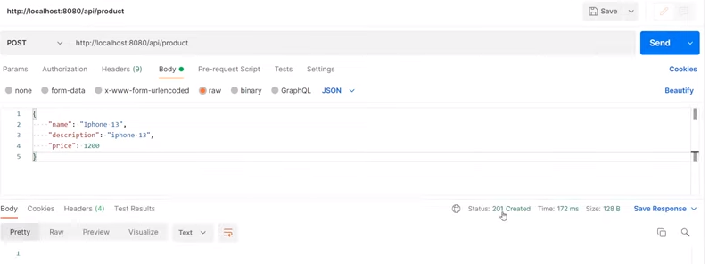
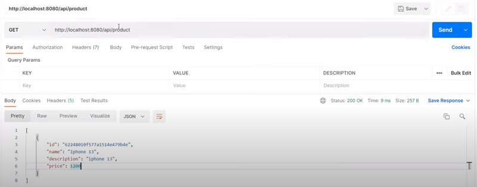

### Test Containers:

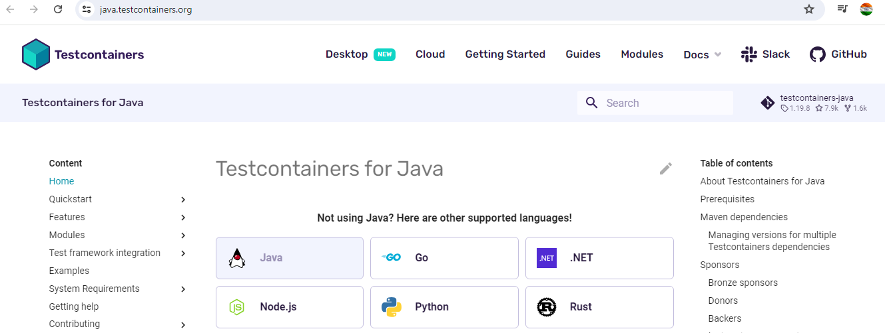

- Test Containers maven dependency

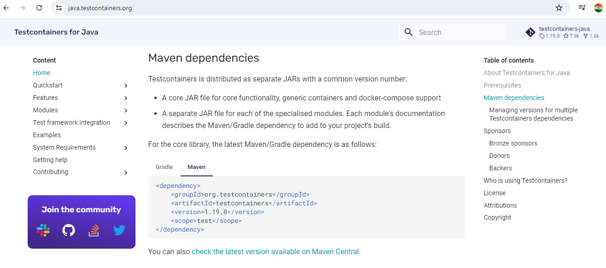

- For Multi dependencies
  
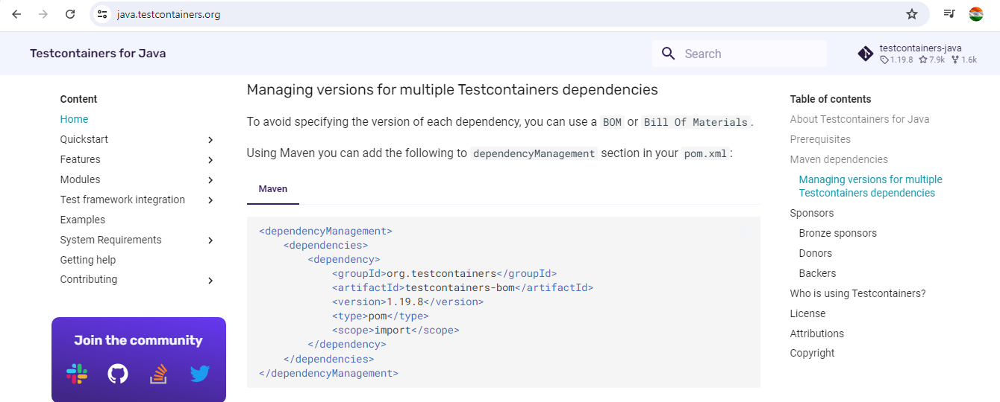

- For Mongo DB

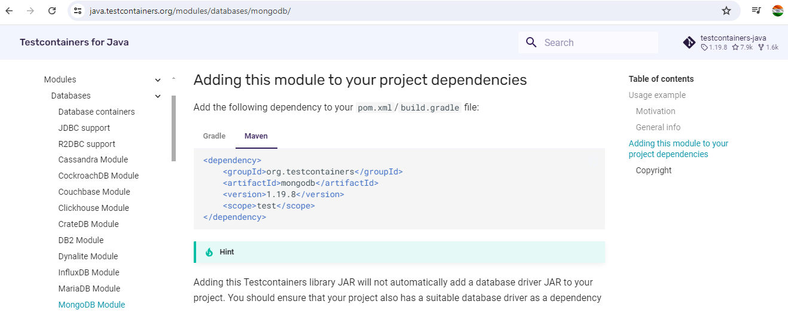

- For JUnit

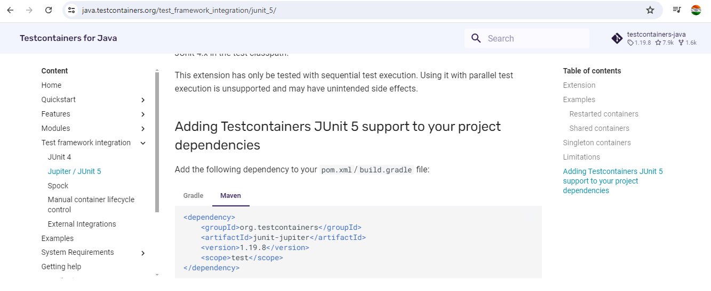

### Write Integration Tests

### Implement Automated Tests:

ProductServiceApplicationTests.java

version-1:
```java
package com.springboot.microservice.products;

import com.fasterxml.jackson.databind.ObjectMapper;
import com.springboot.microservice.products.dto.ProductRequest;
import com.springboot.microservice.products.repository.ProductRepository;
import org.junit.jupiter.api.Assertions;
import org.junit.jupiter.api.Test;
import org.springframework.beans.factory.annotation.Autowired;
import org.springframework.boot.test.autoconfigure.web.servlet.AutoConfigureMockMvc;
import org.springframework.boot.test.context.SpringBootTest;
import org.springframework.http.MediaType;
import org.springframework.test.context.DynamicPropertyRegistry;
import org.springframework.test.context.DynamicPropertySource;
import org.springframework.test.web.servlet.MockMvc;
import org.springframework.test.web.servlet.request.MockMvcRequestBuilders;
import org.testcontainers.containers.MongoDBContainer;
import org.testcontainers.junit.jupiter.Container;
import org.testcontainers.junit.jupiter.Testcontainers;

import java.math.BigDecimal;

import static org.springframework.test.web.servlet.result.MockMvcResultMatchers.status;

@SpringBootTest
@Testcontainers
@AutoConfigureMockMvc
class ProductServiceApplicationTests {

    @Container
    static MongoDBContainer mongoDBContainer = new MongoDBContainer("mongo:4.4.2");
    @Autowired
    private MockMvc mockMvc;
    @Autowired
    private ObjectMapper objectMapper;
    @Autowired
    private ProductRepository productRepository;

    @DynamicPropertySource
    static void setProperties(DynamicPropertyRegistry dymDynamicPropertyRegistry) {
        dymDynamicPropertyRegistry.add("spring.data.mongodb.uri", mongoDBContainer::getReplicaSetUrl);
    }

    @Test
    void shouldCreateProduct() throws Exception {
        ProductRequest productRequest = getProductRequest();
        String productRequestString = objectMapper.writeValueAsString(productRequest);
        mockMvc.perform(MockMvcRequestBuilders.post("/api/product")
                        .contentType(MediaType.APPLICATION_JSON)
                        .content(productRequestString))
                .andExpect(status().isCreated());
        Assertions.assertEquals(1, productRepository.findAll().size());
    }

    private ProductRequest getProductRequest() {
        return ProductRequest.builder()
                .name("iPhone 13")
                .description("iPhone 13")
                .price(BigDecimal.valueOf(1200))
                .build();
    }

}
```
version-2:

```java
package com.springboot.microservice.products;

import com.springboot.microservice.dto.ProductRequest;
import io.restassured.RestAssured;
import org.hamcrest.Matchers;
import org.junit.jupiter.api.BeforeEach;
import org.junit.jupiter.api.Test;
import org.springframework.boot.test.context.SpringBootTest;
import org.springframework.boot.test.web.server.LocalServerPort;
import org.springframework.boot.testcontainers.service.connection.ServiceConnection;
import org.testcontainers.containers.MongoDBContainer;
import java.math.BigDecimal;

@SpringBootTest(webEnvironment = SpringBootTest.WebEnvironment.RANDOM_PORT)
class ProductServiceApplicationTests {

    @ServiceConnection
    static MongoDBContainer mongoDBContainer = new MongoDBContainer("mongo:7.0.7");
    @LocalServerPort
    private Integer port;

    @BeforeEach
    void setup() {
        RestAssured.baseURI = "http://localhost";
        RestAssured.port = port;
    }

    static {
        mongoDBContainer.start();
    }

    @Test
    void shouldCreateProduct() throws Exception {
        ProductRequest productRequest = getProductRequest();
        RestAssured.given()
                .contentType("application/json")
                .body(productRequest)
                .when()
                .post("/api/product")
                .then()
                .log().all()
                .statusCode(201)
                .body("id", Matchers.notNullValue())
                .body("name", Matchers.equalTo(productRequest.name()))
                .body("description", Matchers.equalTo(productRequest.description()))
                .body("price", Matchers.is(productRequest.price().intValueExact()));
    }
    private ProductRequest getProductRequest() {
        return new ProductRequest("iPhone 13", "iPhone 13", BigDecimal.valueOf(1200));
    }
}
```

### Generate Order Service

- 2. order-service Module

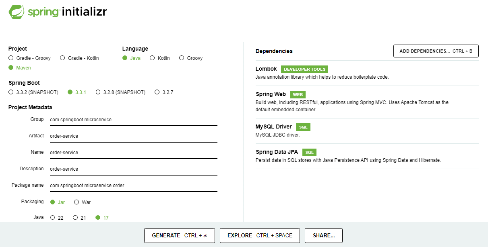

The Repository module contains repositories to be used in the project. It depends on the Model Module.
```
order-service
├── src
│   ├── main
│   │   ├── java
│   │   │   └── com
|   |   |       └── springboot
|   |   |           └── microservice
|   |   |               └── order
|   |   |                   ├── OrdreServiceApplication.java
|   |   |                   ├── client
|   |   |                   |   └── InventoryClient.java
|   |   |                   ├── config
|   |   |                   |   └── WebClientConfig.java (added in intial version)
|   |   |                   ├── controller
|   |   |                   |   └── OrderController.java
│   │   │                   ├── dto
│   │   │                   │   └── InventoryResponse.java
│   │   │                   │   └── OrderLineItemsDto.java
│   │   │                   │   └── OrderRequest.java
│   │   │                   ├── model
│   │   │                   │   └── Order.java
│   │   │                   │   └── OrderLineItems.java
|   |   |                   ├── service
|   |   |                   |   └── OrderService.java
|   |   |                   └── repository
|   |   |                       └── OrderRepository.java
|   |   └── resources
|   |       ├── application.properties
|   |       ├── static
|   |       ├── templates
|   |       └── META-INF
|   |           └── MANIFEST.MF
|   └── src
|       ├── test
|       │   ├── java
|       │   │   └── com
|       │   │       └── springboot
|       │   │           └── microservice
|       │   │               └── order
|       │   │                   ├── stub
|       │   │                   │    └── InventoryStub.java
|       │   │                   └── OrderServiceApplicationTest.java
|       └── resources
|           └── application.properties
└── pom.xml
```
### Implement Order Service

In this structure:

OrdreServiceApplication.java is the main class that contains the main method to run the Spring Boot application.

WebClientConfig.java

```java
package com.springboot.microservice.order.config;

import org.springframework.context.annotation.Bean;
import org.springframework.context.annotation.Configuration;
import org.springframework.web.reactive.function.client.WebClient;

@Configuration
public class WebClientConfig {

    @Bean
    public WebClient webClient(){
        return WebClient.builder().build();
    }
}
```

controller package contains the controller classes with mapping endpoints.

```java
package com.springboot.microservice.order.controller;

import com.springboot.microservice.order.dto.OrderRequest;
import com.springboot.microservice.order.service.OrderService;
import lombok.RequiredArgsConstructor;
import org.springframework.http.HttpStatus;
import org.springframework.web.bind.annotation.*;

@RestController
@RequestMapping("/api/order")
@RequiredArgsConstructor
public class OrderController {

    private final OrderService orderService;

    @PostMapping
    @ResponseStatus(HttpStatus.CREATED)
    public String placeOrder(@RequestBody OrderRequest orderRequest) {
        orderService.placeOrder(orderRequest);
        return "Order Placed Successfully";
    }
}
```

dto package contains the dto classes that interact with the database.

OrderLineItemsDto.java

```java
package com.springboot.microservice.order.dto;

import lombok.AllArgsConstructor;
import lombok.Data;
import lombok.NoArgsConstructor;

import java.math.BigDecimal;

@Data
@AllArgsConstructor
@NoArgsConstructor
public class OrderLineItemsDto {
    private Long id;
    private String skuCode;
    private BigDecimal price;
    private Integer quantity;
}
```

OrderRequest.java

- version-1: with lombok

```java
package com.springboot.microservice.order.dto;

import lombok.AllArgsConstructor;
import lombok.Data;
import lombok.NoArgsConstructor;

import java.util.List;

@Data
@AllArgsConstructor
@NoArgsConstructor
public class OrderRequest {
    private List<OrderLineItemsDto> orderLineItemsDtoList;
}
```
- version-2: with record

```java
package com.springboot.microservice.order.dto;
import java.math.BigDecimal;

public record OrderRequest(Long id, String skuCode, BigDecimal price, Integer quantity) {
}
```
InventoryResponse.java

```java
package com.springboot.microservice.order.dto;

import lombok.AllArgsConstructor;
import lombok.Builder;
import lombok.Data;
import lombok.NoArgsConstructor;

@Data
@AllArgsConstructor
@NoArgsConstructor
@Builder
public class InventoryResponse {
    private String skuCode;
    private boolean isInStock;
}
```
model package contains the model classes that interact with the database.

Order.java

```java
package com.springboot.microservice.order.model;

import jakarta.persistence.*;
import lombok.AllArgsConstructor;
import lombok.Getter;
import lombok.NoArgsConstructor;
import lombok.Setter;

import java.math.BigDecimal;

@Entity
@Table(name = "t_orders")
@Getter
@Setter
@NoArgsConstructor
@AllArgsConstructor
public class Order {
    @Id
    @GeneratedValue(strategy = GenerationType.IDENTITY)
    private Long id;
    private String orderNumber;
    private String skuCode;
    private BigDecimal price;
    private Integer quantity;
}
```

OrderLineItems.java

```java
package com.springboot.microservice.order.model;

import lombok.AllArgsConstructor;
import lombok.Getter;
import lombok.NoArgsConstructor;
import lombok.Setter;

import javax.persistence.*;
import java.math.BigDecimal;

@Entity
@Table(name = "t_order_line_items")
@Getter
@Setter
@AllArgsConstructor
@NoArgsConstructor
public class OrderLineItems {
    @Id
    @GeneratedValue(strategy = GenerationType.IDENTITY)
    private Long id;
    private String skuCode;
    private BigDecimal price;
    private Integer quantity;
}
```
service package contains the service classes which contain business logic.

OrderService.java

- version-1: with WebClient for inter-communication

```java
package com.programmingtechie.orderservice.service;

import com.programmingtechie.orderservice.dto.InventoryResponse;
import com.programmingtechie.orderservice.dto.OrderLineItemsDto;
import com.programmingtechie.orderservice.dto.OrderRequest;
import com.programmingtechie.orderservice.model.Order;
import com.programmingtechie.orderservice.model.OrderLineItems;
import com.programmingtechie.orderservice.repository.OrderRepository;
import lombok.RequiredArgsConstructor;
import org.springframework.stereotype.Service;
import org.springframework.transaction.annotation.Transactional;
import org.springframework.web.reactive.function.client.WebClient;

import java.util.Arrays;
import java.util.List;
import java.util.UUID;

@Service
@RequiredArgsConstructor
@Transactional
public class OrderService {

    private final OrderRepository orderRepository;
    private final WebClient webClient;

    public void placeOrder(OrderRequest orderRequest) {
        Order order = new Order();
        order.setOrderNumber(UUID.randomUUID().toString());

        List<OrderLineItems> orderLineItems = orderRequest.getOrderLineItemsDtoList()
                .stream()
                .map(this::mapToDto)
                .toList();

        order.setOrderLineItemsList(orderLineItems);

        List<String> skuCodes = order.getOrderLineItemsList().stream()
                .map(OrderLineItems::getSkuCode)
                .toList();

        // Call Inventory Service, and place order if product is in
        // stock
        InventoryResponse[] inventoryResponsArray = webClient.get()
                .uri("http://localhost:8082/api/inventory",
                        uriBuilder -> uriBuilder.queryParam("skuCode", skuCodes).build())
                .retrieve()
                .bodyToMono(InventoryResponse[].class)
                .block();

        boolean allProductsInStock = Arrays.stream(inventoryResponsArray)
                .allMatch(InventoryResponse::isInStock);

        if(allProductsInStock){
            orderRepository.save(order);
        } else {
            throw new IllegalArgumentException("Product is not in stock, please try again later");
        }
    }

    private OrderLineItems mapToDto(OrderLineItemsDto orderLineItemsDto) {
        OrderLineItems orderLineItems = new OrderLineItems();
        orderLineItems.setPrice(orderLineItemsDto.getPrice());
        orderLineItems.setQuantity(orderLineItemsDto.getQuantity());
        orderLineItems.setSkuCode(orderLineItemsDto.getSkuCode());
        return orderLineItems;
    }
}
```
- version-2: with FeignClient i.e. InventoryClient for inter-communication

```java
package com.springboot.microservice.order.service;

import com.springboot.microservice.order.client.InventoryClient;
import com.springboot.microservice.order.dto.OrderRequest;
import com.springboot.microservice.order.model.Order;
import com.springboot.microservice.order.repository.OrderRepository;
import lombok.RequiredArgsConstructor;
import org.springframework.stereotype.Service;
import org.springframework.transaction.annotation.Transactional;

import java.util.UUID;

@Service
@RequiredArgsConstructor
@Transactional
public class OrderService {

    private final OrderRepository orderRepository;
    private final InventoryClient inventoryClient;

    public void placeOrder(OrderRequest orderRequest) {
        boolean inStock = inventoryClient.isInStock(orderRequest.skuCode(), orderRequest.quantity());
        if (inStock) {
            var order = mapToOrder(orderRequest);
            orderRepository.save(order);
        } else {
            throw new RuntimeException("Product with Skucode " + orderRequest.skuCode() + "is not in stock");
        }
    }

    private static Order mapToOrder(OrderRequest orderRequest) {
        Order order = new Order();
        order.setOrderNumber(UUID.randomUUID().toString());
        order.setPrice(orderRequest.price());
        order.setQuantity(orderRequest.quantity());
        order.setSkuCode(orderRequest.skuCode());
        return order;
    }
}
```
repository package contains the repository classes that interact with the database.
```java
package com.springboot.microservice.order.repository;

import com.springboot.microservice.order.model.Order;
import org.springframework.data.jpa.repository.JpaRepository;

public interface OrderRepository extends JpaRepository<Order, Long> {
}
```
InventoryClient.java:

```java
package com.springboot.microservice.order.client;

import org.springframework.cloud.openfeign.FeignClient;
import org.springframework.web.bind.annotation.RequestMapping;
import org.springframework.web.bind.annotation.RequestMethod;
import org.springframework.web.bind.annotation.RequestParam;

@FeignClient(value = "inventory", url = "${inventory.url}")
public interface InventoryClient {
    @RequestMapping(method = RequestMethod.GET, value = "/api/inventory")
    boolean isInStock(@RequestParam String skuCode, @RequestParam Integer quantity);
}
```

application.properties contains application-specific properties.

```
#spring.datasource.driver-class-name=com.mysql.jdbc.Driver
#spring.datasource.url=jdbc:mysql://localhost:3306/order-service
spring.datasource.driver-class-name=com.mysql.cj.jdbc.Driver
spring.datasource.url=jdbc:mysql://localhost:3306/order_service
spring.datasource.username=root
spring.datasource.password=mysql
spring.jpa.hibernate.ddl-auto=none
server.port=8081
inventory.url=http://localhost:8082
```
static directory contains static resources like Javascript, CSS, etc.

templates directory contains HTML templates for the application.

META-INF directory contains the manifest file.

pom.xml:

```pom
<?xml version="1.0" encoding="UTF-8"?>
<project xmlns="http://maven.apache.org/POM/4.0.0" xmlns:xsi="http://www.w3.org/2001/XMLSchema-instance"
  xsi:schemaLocation="http://maven.apache.org/POM/4.0.0 https://maven.apache.org/xsd/maven-4.0.0.xsd">
  <modelVersion>4.0.0</modelVersion>
  <parent>
    <groupId>org.springframework.boot</groupId>
    <artifactId>spring-boot-starter-parent</artifactId>
    <version>3.3.1</version>
    <relativePath/> <!-- lookup parent from repository -->
  </parent>
  <groupId>com.springboot.microservice</groupId>
  <artifactId>order-service</artifactId>
  <version>0.0.1-SNAPSHOT</version>
  <name>product-service</name>
  <description>order-service</description>
  <url/>  
  <properties>
    <java.version>17</java.version>
  </properties>
  <dependencies>
    <dependency>
      <groupId>org.springframework.boot</groupId>
      <artifactId>spring-boot-starter-data-mongodb</artifactId>
    </dependency>
    <dependency>
      <groupId>org.springframework.boot</groupId>
      <artifactId>spring-boot-starter-web</artifactId>
    </dependency>
    <dependency>
      <groupId>org.projectlombok</groupId>
      <artifactId>lombok</artifactId>
      <optional>true</optional>
    </dependency>
    <dependency>
      <groupId>org.springframework.boot</groupId>
      <artifactId>spring-boot-starter-test</artifactId>
      <scope>test</scope>
    </dependency>
  </dependencies>
  <build>
    <plugins>
      <plugin>
        <groupId>org.springframework.boot</groupId>
        <artifactId>spring-boot-maven-plugin</artifactId>
        <configuration>
          <excludes>
            <exclude>
              <groupId>org.projectlombok</groupId>
              <artifactId>lombok</artifactId>
            </exclude>
          </excludes>
        </configuration>
      </plugin>
    </plugins>
  </build>
</project>
```
- application.properties
```properties
#MongoDB database congfiguration
spring.data.mongodb.uri=mongodb://localhost:27017/product-service
```
### Test Order Service

### Implement Automated Tests:

InventoryStubs.java

```java
package com.springboot.microservice.order.stub;

import lombok.experimental.UtilityClass;
import static com.github.tomakehurst.wiremock.client.WireMock.*;

@UtilityClass
public class InventoryStubs {

    public void stubInventoryCall(String skuCode, Integer quantity) {
        stubFor(get(urlEqualTo("/api/inventory?skuCode=" + skuCode + "&quantity=" + quantity))
                .willReturn(aResponse()
                        .withStatus(200)
                        .withHeader("Content-Type", "application/json")
                        .withBody("true")));
    }
}
```

OrderServiceApplicationTests.java

```java
package com.programmingtechie.orderservice;

import com.springboot.microservice.order.stub.InventoryStubs;
import io.restassured.RestAssured;
import org.hamcrest.Matchers;
import org.junit.jupiter.api.BeforeEach;
import org.junit.jupiter.api.Test;
import org.springframework.boot.test.context.SpringBootTest;
import org.springframework.boot.test.web.server.LocalServerPort;
import org.springframework.boot.testcontainers.service.connection.ServiceConnection;
import org.springframework.cloud.contract.wiremock.AutoConfigureWireMock;
import org.testcontainers.containers.MySQLContainer;

import static org.hamcrest.MatcherAssert.assertThat;

@SpringBootTest(webEnvironment = SpringBootTest.WebEnvironment.RANDOM_PORT)
@AutoConfigureWireMock(port = 0)
class OrderServiceApplicationTests {

    @ServiceConnection
    static MySQLContainer mySQLContainer = new MySQLContainer("mysql:8.3.0");
    @LocalServerPort
    private Integer port;

    @BeforeEach
    void setup() {
        RestAssured.baseURI = "http://localhost";
        RestAssured.port = port;
    }

    static {
        mySQLContainer.start();
    }

    @Test
    void shouldSubmitOrder() {
        String submitOrderJson = """
                {
                     "skuCode": "iphone_15",
                     "price": 1000,
                     "quantity": 1
                }
                """;

        InventoryStubs.stubInventoryCall("iphone_15", 1);
        var responseBodyString = RestAssured.given()
                .contentType("application/json")
                .body(submitOrderJson)
                .when()
                .post("/api/order")
                .then()
                .log().all()
                .statusCode(201)
                .extract()
                .body().asString();

        assertThat(responseBodyString, Matchers.is("Order Placed Successfully"));
    }
}
```
### Generate Inventory Service

- inventory-service Module

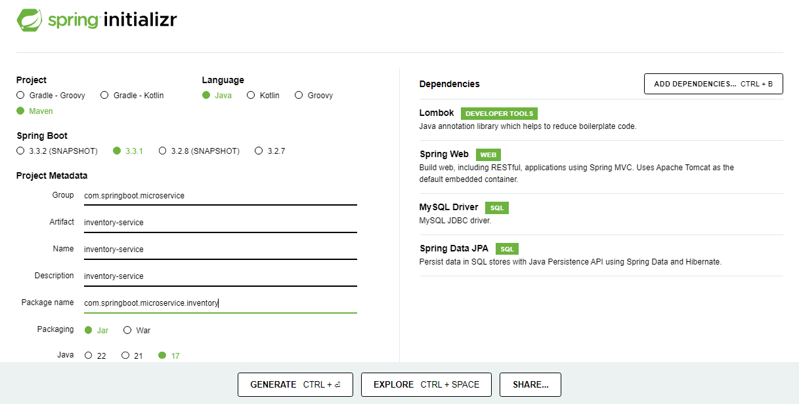

The Service API module contains all project services. It also depends on Model Module.
```
inventory-service
├── src
│   ├── main
│   │   ├── java
│   │   │   └── com
|   |   |       └── springboot
|   |   |           └── microservice
|   |   |               └── inventory
|   |   |                   ├── InventoryServiceApplication.java
|   |   |                   ├── controller
|   |   |                   |   └── InventoryController.java
│   │   │                   ├── dto
│   │   │                   │   └── InventoryResponse.java
│   │   │                   ├── model
│   │   │                   │   └── Inventory.java
|   |   |                   ├── service
|   |   |                   |   └── InventoryService.java
|   |   |                   └── repository
|   |   |                       └── InventoryRepository.java
|   |   └── resources
|   |       ├── application.properties
|   |       ├── static
|   |       ├── templates
|   |       └── META-INF
|   |           └── MANIFEST.MF
|   └── src
|       ├── test
|       │   ├── java
|       │   │   └── com
|       │   │       └── springboot
|       │   │           └── microservice
|       │   │               └── inventory
|       │   │                   └── InventoryServiceApplicationTest.java
|       └── resources
|           └── application.properties
└── pom.xml
```
### Implement Inventory Service

In this structure:

InventoryServiceApplication.java is the main class that contains the main method to run the Spring Boot application.

InventoryServiceApplication.java

version 1:

```java
package com.springboot.microservice.inventory;

import org.springframework.boot.SpringApplication;
import org.springframework.boot.autoconfigure.SpringBootApplication;

@SpringBootApplication
public class InventoryServiceApplication {

    public static void main(String[] args) {
        SpringApplication.run(InventoryServiceApplication.class, args);
    }
}
```
version 2:

```java
package com.springboot.microservice.inventory;

import com.springboot.microservice.inventory.model.Inventory;
import com.springboot.microservice.inventory.repository.InventoryRepository;
import org.springframework.boot.CommandLineRunner;
import org.springframework.boot.SpringApplication;
import org.springframework.boot.autoconfigure.SpringBootApplication;
import org.springframework.context.annotation.Bean;

@SpringBootApplication
public class InventoryServiceApplication {

    public static void main(String[] args) {
        SpringApplication.run(InventoryServiceApplication.class, args);
    }

    @Bean
    public CommandLineRunner loadData(InventoryRepository inventoryRepository) {
        return args -> {
            Inventory inventory = new Inventory();
            inventory.setSkuCode("iphone_13");
            inventory.setQuantity(100);

            Inventory inventory1 = new Inventory();
            inventory1.setSkuCode("iphone_13_red");
            inventory1.setQuantity(0);

            inventoryRepository.save(inventory);
            inventoryRepository.save(inventory1);
        };
    }
}
```

controller package contains the controller classes with mapping endpoints.
```java
package com.springboot.microservice.inventory.controller;

import com.springboot.microservice.inventory.service.InventoryService;
import lombok.RequiredArgsConstructor;
import org.springframework.http.HttpStatus;
import org.springframework.web.bind.annotation.*;

@RestController
@RequestMapping("/api/inventory")
@RequiredArgsConstructor
public class InventoryController {

    private final InventoryService inventoryService;

    // Version-1 List<String> skuCode as RequestParam
    // http://localhost:8082/api/inventory/iphone-13,iphone13-red
    // http://localhost:8082/api/inventory?skuCode=iphone-13&skuCode=iphone13-red

    /*@GetMapping
    @ResponseStatus(HttpStatus.OK)
    public List<InventoryResponse> isInStock(@RequestParam List<String> skuCode) {
        return inventoryService.isInStock(skuCode);
    }*/

    // Version-2 skuCode & quantity as RequestParam
    @GetMapping
    @ResponseStatus(HttpStatus.OK)
    public boolean isInStock(@RequestParam String skuCode, @RequestParam Integer quantity) {
        return inventoryService.isInStock(skuCode, quantity);
    }
}
```
dto package contains the dto classes that interact with the database.

InventoryResponse.java

Version-1:

```java
package com.springboot.microservice.inventory.dto;

import lombok.AllArgsConstructor;
import lombok.Builder;
import lombok.Data;
import lombok.NoArgsConstructor;

@Data
@AllArgsConstructor
@NoArgsConstructor
@Builder
public class InventoryResponse {
    private String skuCode;
    private boolean isInStock;
}
```
Version-2:

```java
package com.springboot.microservice.inventory.dto;

public record InventoryResponse(String skuCode, boolean isInStock) {
}
```
model package contains the model classes that interact with the database.
```java
package com.springboot.microservice.inventory.model;

import lombok.AllArgsConstructor;
import lombok.Getter;
import lombok.NoArgsConstructor;
import lombok.Setter;

import jakarta.persistence.*;

@Entity
@Table(name = "t_inventory")
@Getter
@Setter
@AllArgsConstructor
@NoArgsConstructor
public class Inventory {

    @Id
    @GeneratedValue(strategy = GenerationType.IDENTITY)
    private Long id;
    private String skuCode;
    private Integer quantity;
}
```

service package contains the service classes which contain business logic.
InventoryService.java

version: 1 - with List<String> skuCode

```java
package com.springboot.microservice.inventory.service;

import com.springboot.microservice.inventory.dto.InventoryResponse;
import com.springboot.microservice.inventory.repository.InventoryRepository;
import lombok.RequiredArgsConstructor;
import org.springframework.stereotype.Service;
import org.springframework.transaction.annotation.Transactional;

import java.util.List;

@Service
@RequiredArgsConstructor
public class InventoryService {

    private final InventoryRepository inventoryRepository;

    @Transactional(readOnly = true)
    public List<InventoryResponse> isInStock(List<String> skuCode) {
        return inventoryRepository.findBySkuCodeIn(skuCode).stream()
                .map(inventory ->
                        InventoryResponse.builder()
                                .skuCode(inventory.getSkuCode())
                                .isInStock(inventory.getQuantity() > 0)
                                .build()
                ).toList();
    }
}
```
version: 2 - with skuCode & quantity
```java
package com.springboot.microservice.inventory.service;

import com.springboot.microservice.inventory.repository.InventoryRepository;
import lombok.RequiredArgsConstructor;
import org.springframework.stereotype.Service;
import org.springframework.transaction.annotation.Transactional;

@Service
@RequiredArgsConstructor
public class InventoryService {

    private final InventoryRepository inventoryRepository;

    @Transactional(readOnly = true)
    public boolean isInStock(String skuCode, Integer quantity) {
        return inventoryRepository.existsBySkuCodeAndQuantityIsGreaterThanEqual(skuCode, quantity);
    }
}
```
repository package contains the repository classes that interact with the database.
```java
package com.springboot.microservice.inventory.repository;

import com.springboot.microservice.inventory.model.Inventory;
import org.springframework.data.jpa.repository.JpaRepository;

public interface InventoryRepository extends JpaRepository<Inventory, Long> {
    //version: 1 - with List<String> skuCode
    //List<Inventory> findBySkuCodeIn(List<String> skuCode);
    boolean existsBySkuCodeAndQuantityIsGreaterThanEqual(String skuCode, int quantity);
}
```
application.properties contains application-specific properties.
```
spring.datasource.driver-class-name=com.mysql.cj.jdbc.Driver
spring.datasource.url=jdbc:mysql://localhost:3306/inventory_service
spring.datasource.username=root
spring.datasource.password=mysql
#spring.jpa.hibernate.ddl-auto=create-drop
spring.jpa.hibernate.ddl-auto=none
server.port=8082
```
static directory contains static resources like Javascript, CSS, etc.

templates directory contains HTML templates for the application.

META-INF directory contains the manifest file.

pom.xml:

```pom
<?xml version="1.0" encoding="UTF-8"?>
<project xmlns="http://maven.apache.org/POM/4.0.0" xmlns:xsi="http://www.w3.org/2001/XMLSchema-instance"
  xsi:schemaLocation="http://maven.apache.org/POM/4.0.0 https://maven.apache.org/xsd/maven-4.0.0.xsd">
  <modelVersion>4.0.0</modelVersion>
  <parent>
    <groupId>org.springframework.boot</groupId>
    <artifactId>spring-boot-starter-parent</artifactId>
    <version>3.3.1</version>
    <relativePath/> <!-- lookup parent from repository -->
  </parent>
  <groupId>com.springboot.microservice</groupId>
  <artifactId>inventory-service</artifactId>
  <version>0.0.1-SNAPSHOT</version>
  <name>product-service</name>
  <description>inventory-service</description>
  <url/>  
  <properties>
    <java.version>17</java.version>
  </properties>
  <dependencies>
    <dependency>
      <groupId>org.springframework.boot</groupId>
      <artifactId>spring-boot-starter-data-mongodb</artifactId>
    </dependency>
    <dependency>
      <groupId>org.springframework.boot</groupId>
      <artifactId>spring-boot-starter-web</artifactId>
    </dependency>
    <dependency>
      <groupId>org.projectlombok</groupId>
      <artifactId>lombok</artifactId>
      <optional>true</optional>
    </dependency>
    <dependency>
      <groupId>org.springframework.boot</groupId>
      <artifactId>spring-boot-starter-test</artifactId>
      <scope>test</scope>
    </dependency>
  </dependencies>
  <build>
    <plugins>
      <plugin>
        <groupId>org.springframework.boot</groupId>
        <artifactId>spring-boot-maven-plugin</artifactId>
        <configuration>
          <excludes>
            <exclude>
              <groupId>org.projectlombok</groupId>
              <artifactId>lombok</artifactId>
            </exclude>
          </excludes>
        </configuration>
      </plugin>
    </plugins>
  </build>
</project>
```
- application.properties
```properties
#MongoDB database congfiguration
spring.data.mongodb.uri=mongodb://localhost:27017/product-service
```
### Test Inventory Service

### Implement Automated Tests:

InventoryServiceApplicationTests.java

```java

package com.springboot.microservice.inventory;

import com.jayway.jsonpath.JsonPath;
import io.restassured.RestAssured;
import org.hamcrest.Matchers;
import org.junit.jupiter.api.BeforeEach;
import org.junit.jupiter.api.Test;
import org.springframework.boot.test.context.SpringBootTest;
import org.springframework.boot.test.web.server.LocalServerPort;
import org.springframework.boot.testcontainers.service.connection.ServiceConnection;
import org.testcontainers.containers.MySQLContainer;

import static org.hamcrest.Matchers.is;
import static org.junit.jupiter.api.Assertions.assertFalse;
import static org.junit.jupiter.api.Assertions.assertTrue;

@SpringBootTest(webEnvironment = SpringBootTest.WebEnvironment.RANDOM_PORT)
class InventoryServiceApplicationTests {

    @ServiceConnection
    static MySQLContainer mySQLContainer = new MySQLContainer("mysql:8.3.0");
    @LocalServerPort
    private Integer port;

    @BeforeEach
    void setup() {
        RestAssured.baseURI = "http://localhost";
        RestAssured.port = port;
    }

    static {
        mySQLContainer.start();
    }

    @Test
    void shouldReadInventory() {
        var response = RestAssured.given()
                .when()
                .get("/api/inventory?skuCode=iphone_15&quantity=1")
                .then()
                .log().all()
                .statusCode(200)
                .extract().response().as(Boolean.class);
        assertTrue(response);

        var negativeResponse = RestAssured.given()
                .when()
                .get("/api/inventory?skuCode=iphone_15&quantity=1000")
                .then()
                .log().all()
                .statusCode(200)
                .extract().response().as(Boolean.class);
        assertFalse(negativeResponse);

    }
}
```
### Migrate to Maven Multi-Module Project

Step 1: Create a Maven Project with the name spring-boot-microservices.

Step 2: Open the pom.xml (parent pom) file and change the packaging type jar to pom.

pom.xml (parent pom)
```pom
<?xml version="1.0" encoding="UTF-8"?>
<project xmlns="http://maven.apache.org/POM/4.0.0"
         xmlns:xsi="http://www.w3.org/2001/XMLSchema-instance"
         xsi:schemaLocation="http://maven.apache.org/POM/4.0.0 http://maven.apache.org/xsd/maven-4.0.0.xsd">
    <modelVersion>4.0.0</modelVersion>

    <parent>
        <groupId>org.springframework.boot</groupId>
        <artifactId>spring-boot-starter-parent</artifactId>
        <version>3.2.4</version>
        <relativePath/> <!-- lookup parent from repository -->
    </parent>

    <groupId>com.springboot.microservice</groupId>
    <artifactId>spring-boot-microservices</artifactId>
    <packaging>pom</packaging>
    <version>1.0-SNAPSHOT</version>
    <properties>
        <maven.compiler.source>21</maven.compiler.source>
        <maven.compiler.target>21</maven.compiler.target>
    </properties>

    <build>
        <plugins>
            <plugin>
                <groupId>org.springframework.boot</groupId>
                <artifactId>spring-boot-maven-plugin</artifactId>
                <configuration>
                    <excludes>
                        <exclude>
                            <groupId>org.projectlombok</groupId>
                            <artifactId>lombok</artifactId>
                        </exclude>
                    </excludes>
                </configuration>
            </plugin>
        </plugins>
    </build>
</project>
```
One thing to be noticed in the above pom file is that there is no maven module configured because we have not created yet. Now we will create Maven Modules one by one that we have specified above.

- Product-Service
	- Create a new Spring Boot project for Product-Service
	- Implement REST endpoints for CRUD operations on products
	- Add dependencies for Spring Web, Spring Data JPA, and H2 database
	- Create entity class for Product and repository interface for database operations
- Order-Service
	- Create a new Spring Boot project for Order-Service
	- Implement REST endpoints for CRUD operations on orders
	- Add dependencies for Spring Web, Spring Data JPA, and H2 database
	- Create entity class for Order and repository interface for database operations
- Inventory-Service
	- Create a new Spring Boot project for Inventory-Service
	- Implement REST endpoints for checking and updating product inventory
	- Add dependencies for Spring Web, Spring Data JPA, and H2 database
	- Create entity class for InventoryItem and repository interface for database operations

  
By following this structure, you can create a modular and scalable microservice architecture using Spring Boot. Each microservice is responsible for a specific domain (such as products, orders, inventory) and can be easily extended or updated without affecting other services.

Step 3: Open the pom.xml (parent pom) file.

pom.xml (parent pom)
```pom
<?xml version="1.0" encoding="UTF-8"?>
<project xmlns="http://maven.apache.org/POM/4.0.0"
         xmlns:xsi="http://www.w3.org/2001/XMLSchema-instance"
         xsi:schemaLocation="http://maven.apache.org/POM/4.0.0 http://maven.apache.org/xsd/maven-4.0.0.xsd">
    <modelVersion>4.0.0</modelVersion>

    <parent>
        <groupId>org.springframework.boot</groupId>
        <artifactId>spring-boot-starter-parent</artifactId>
        <version>3.2.4</version>
        <relativePath/> <!-- lookup parent from repository -->
    </parent>

    <groupId>com.springboot.microservice</groupId>
    <artifactId>spring-boot-microservices</artifactId>
    <packaging>pom</packaging>
    <version>1.0-SNAPSHOT</version>
    <modules>
        <module>product-service</module>
        <module>order-service</module>
        <module>inventory-service</module>
    </modules>

    <properties>
        <maven.compiler.source>21</maven.compiler.source>
        <maven.compiler.target>21</maven.compiler.target>
        <spring-cloud.version>2023.0.1</spring-cloud.version>
    </properties>

    <build>
        <plugins>
            <plugin>
                <groupId>org.springframework.boot</groupId>
                <artifactId>spring-boot-maven-plugin</artifactId>
                <configuration>
                    <excludes>
                        <exclude>
                            <groupId>org.projectlombok</groupId>
                            <artifactId>lombok</artifactId>
                        </exclude>
                    </excludes>
                </configuration>
            </plugin>
        </plugins>
    </build>
</project>
```

```
spring-boot-microservices
├───product-service
|   ├── src
|   │   ├── main
|   │   │   ├── java
|   │   │   │   └── com
|   |   |   |       └── springboot
|   |   |   |           └── microservice
|   |   |   |               └── product
|   |   |   |                   ├── ProductServiceApplication.java
|   |   |   |                   ├── controller
|   |   |   |                   |   └── ProductController.java
|   |   |   |                   ├── dto
|   |   |   |                   |   ├── ProductRequest.java
|   |   |   |                   |   └── ProductResponse.java
│   |   │   │                   ├── model
│   |   │   │                   │   └── Product.java
|   |   |   |                   ├── service
|   |   |   |                   |   └── ProductService.java
|   |   |   |                   └── repository
|   |   |   |                       └── ProductRepository.java
|   |   |   └── resources
|   |   |       ├── application.properties
|   |   |       ├── static
|   |   |       ├── templates
|   |   |       └── META-INF
|   |   |           └── MANIFEST.MF
|   |   └── src
|   |       ├── test
|   |       │   ├── java
|   |       │   │   └── com
|   |       │   │       └── springboot
|   |       │   │           └── microservice
|   |       │   │               └── product
|   |       │   │                   └── ProductServiceApplicationTest.java
|   |       └── resources
|   |           └── application.properties
|   └── pom.xml
├───order-service
|   ├── src
|   │   ├── main
|   │   │   ├── java
|   │   │   │   └── com
|   |   |   |       └── springboot
|   |   |   |           └── microservice
|   |   |   |               └── order
|   |   |   |                   ├── OrderServiceApplication.java
|   |   |   |                   ├── controller
|   |   |   |                   |   └── OrderController.java
|   |   |   |                   ├── dto
|   |   |   |                   |   ├── OrdertRequest.java
|   |   |   |                   |   └── OrderResponse.java
│   |   │   │                   ├── model
│   |   │   │                   │   └── Order.java
|   |   |   |                   ├── service
|   |   |   |                   |   └── OrderService.java
|   |   |   |                   └── repository
|   |   |   |                       └── OrderRepository.java
|   |   |   └── resources
|   |   |       ├── application.properties
|   |   |       ├── static
|   |   |       ├── templates
|   |   |       └── META-INF
|   |   |           └── MANIFEST.MF
|   |   └── src
|   |       ├── test
|   |       │   ├── java
|   |       │   │   └── com
|   |       │   │       └── springboot
|   |       │   │           └── microservice
|   |       │   │               └── order
|   |       │   │                   └── OrderServiceApplicationTest.java
|   |       └── resources
|   |           └── application.properties
|   └── pom.xml
├───inventory-service
|   ├── src
|   │   ├── main
|   │   │   ├── java
|   │   │   │   └── com
|   |   |   |       └── springboot
|   |   |   |           └── microservice
|   |   |   |               └── inventory
|   |   |   |                   ├── InventoryServiceApplication.java
|   |   |   |                   ├── controller
|   |   |   |                   |   └── InventoryController.java
|   |   |   |                   ├── dto
|   |   |   |                   |   ├── InventoryRequest.java
|   |   |   |                   |   └── InventoryResponse.java
│   |   │   │                   ├── model
│   |   │   │                   │   └── Inventory.java
|   |   |   |                   ├── service
|   |   |   |                   |   └── InventoryService.java
|   |   |   |                   └── repository
|   |   |   |                       └── InventoryRepository.java
|   |   |   └── resources
|   |   |       ├── application.properties
|   |   |       ├── static
|   |   |       ├── templates
|   |   |       └── META-INF
|   |   |           └── MANIFEST.MF
|   |   └── src
|   |       ├── test
|   |       │   ├── java
|   |       │   │   └── com
|   |       │   │       └── springboot
|   |       │   │           └── microservice
|   |       │   │               └── inventory
|   |       │   │                   └── InventoryServiceApplicationTest.java
|   |       └── resources
|   |           └── application.properties
|   └── pom.xml
└── pom.xml
```

- product-service: This module contains the code for managing products.
- order-service: This module contains the code for managing orders.
- inventory-service: This module contains the code for managing inventory.
- pom.xml: Main Maven project file that includes all the submodule dependencies.
  
### Bugfix in Inventory Service


