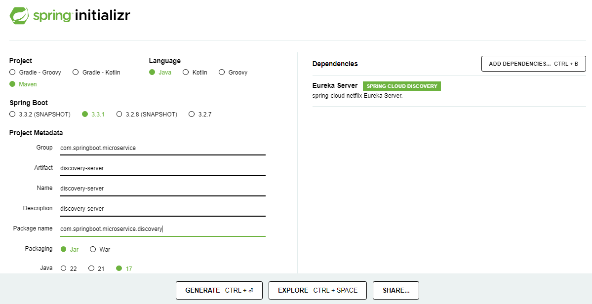

## [<<PREV](Part_02_Spring_Boot_Microservices_Inter_Service_Communication.md) - MICROSERVICE SERVICE DISCOVERY - [NEXT>>](Part_04_Spring_Boot_Microservices_API_Gateway.md)


### TABLE OF CONTENTS

- [01 - Service Registry communication](#service-registry-communication)
- [02 - Inter Service Communication Between Order & Inventory Microservices](#inter-service-communication-between-order-and-inventory-microservices)
- [03 - Update Order Service Structure](#update-order-service-structure)
- [04 - Update Order Service](#update-order-service)
- [05 - Implement Product Service](#implement-product-service)
- [06 - Manual Testing through Postman](#manual-testing-through-postman)
- [07 - Implement Automated Tests](#implement-automated-tests)
- [08 - Test Containers](#test-containers)
- [09 - Write Integration Tests](#write-wntegration-tests)
- [10 - Generate Order Service](#generate-order-service)
- [11 - Implement Order Service](#implement-order-service)
- [12 - Test Order Service](#test-order-service)
- [13 - Update Inventory Service Structure](#update-inventory-service-structure)
- [14 - Update Inventory Service](#update-inventory-service)
- [15 - Migrate to Maven Multi-Module Project](#migrate-to-maven-multi-module-project)
- [16 - Bugfix in Inventory Service](#bugfix-in-inventory-service)

### Service Registry communication


Service Registry communication:


Service Registry Local Copy:


Service Registry Local Copy:


### Spring Cloud Netflix

**Spring Cloud Netflix** provides **Netflix OSS integrations** for Spring Boot apps through autoconfiguration and binding to the Spring Environment and other Spring programming model idioms. With a few simple annotations, you can quickly enable and configure the common patterns inside your application and build large distributed systems with battle-tested **Netflix** components. The patterns provided include **Service Discovery (Eureka)**.

### Features
Spring Cloud Netflix features:

- **Service Discovery**: **Eureka instances** can be registered and clients can discover the instances using Spring-managed beans

- **Service Discovery**: an **embedded Eureka server** can be created with declarative Java configuration

### Getting Started

As long as Spring Cloud Netflix and Eureka Core are on the classpath any Spring Boot application with **@EnableEurekaClient** will try to contact a Eureka server on [http://localhost:8761](http://localhost:8761) (the default value of `eureka.client.serviceUrl.defaultZone`):

```java
@SpringBootApplication
@EnableEurekaClient
@RestController
public class Application {

  @RequestMapping("/")
  public String home() {
    return "Hello World";
  }

  public static void main(String[] args) {
    SpringApplication.run(Application.class, args);
  }
}
```
To run your own server use the **spring-cloud-starter-netflix-eureka-server** dependency and **@EnableEurekaServer**.

### Create A Dicovery Server Module

- dicovery-server Module



The Service Implementation module implements the service. It depends on Repository Module and Service API Module.
```
dicovery-server
├── src
│   ├── main
│   │   ├── java
│   │   │   └── com
|   |   |       └── springboot
|   |   |           └── microservice
|   |   |               └── discovery
|   |   |                   └── DiscoveryServerApplication.java
|   |   └── resources
|   |       ├── application.properties
|   |       ├── static
|   |       ├── templates
|   |       └── META-INF
|   |           └── MANIFEST.MF
|   └── src
|       ├── test
|       │   ├── java
|       │   │   └── com
|       │   │       └── springboot
|       │   │           └── microservice
|       │   │               └── discovery
|       │   │                   └── DiscoveryServerApplicationTest.java
|       └── resources
|           └── application.properties
└── pom.xml
```
In this structure:

RegistryServiceApplication.java is the main class that contains the main method to run the Spring Boot application.
```java
package com.programming.techie.discoveryserver;

import org.springframework.boot.SpringApplication;
import org.springframework.boot.autoconfigure.SpringBootApplication;
import org.springframework.cloud.netflix.eureka.server.EnableEurekaServer;

@SpringBootApplication
@EnableEurekaServer
public class DiscoveryServerApplication {
    public static void main(String[] args) {
        SpringApplication.run(DiscoveryServerApplication.class, args);
    }
}
```
application.properties contains application-specific properties.

```properties
eureka.instance.hostname=localhost
eureka.client.register-with-eureka=false
eureka.client.fetch-registry=false
eureka.client.serviceUrl.defaultZone=http://localhost:8761/eureka
server.port=8761
```

discovery-server pom.xml with Eureka Server dependency:

```pom
<?xml version="1.0" encoding="UTF-8"?>
<project xmlns="http://maven.apache.org/POM/4.0.0"
         xmlns:xsi="http://www.w3.org/2001/XMLSchema-instance"
         xsi:schemaLocation="http://maven.apache.org/POM/4.0.0 http://maven.apache.org/xsd/maven-4.0.0.xsd">
    <parent>
        <artifactId>spring-boot-microservices</artifactId>
        <groupId>com.springboot.microservice</groupId>
        <version>1.0-SNAPSHOT</version>
    </parent>
    <modelVersion>4.0.0</modelVersion>
    <artifactId>discovery-server</artifactId>
    <properties>
        <maven.compiler.source>17</maven.compiler.source>
        <maven.compiler.target>17</maven.compiler.target>
    </properties>
    <dependencies>
        <dependency>
            <groupId>org.springframework.cloud</groupId>
            <artifactId>spring-cloud-starter-netflix-eureka-server</artifactId>
        </dependency>
    </dependencies>
</project>
```

- spring-boot-microservices Parent POM

```pom
<?xml version="1.0" encoding="UTF-8"?>
<project xmlns="http://maven.apache.org/POM/4.0.0"
         xmlns:xsi="http://www.w3.org/2001/XMLSchema-instance"
         xsi:schemaLocation="http://maven.apache.org/POM/4.0.0 http://maven.apache.org/xsd/maven-4.0.0.xsd">
    <modelVersion>4.0.0</modelVersion>

    <parent>
        <groupId>org.springframework.boot</groupId>
        <artifactId>spring-boot-starter-parent</artifactId>
        <version>2.6.6</version>
        <relativePath/> <!-- lookup parent from repository -->
    </parent>

    <groupId>com.springboot.microservice</groupId>
    <artifactId>spring-boot-microservices</artifactId>
    <packaging>pom</packaging>
    <version>1.0-SNAPSHOT</version>
    <modules>
        <module>product-service</module>
        <module>order-service</module>
        <module>inventory-service</module>
        <module>discovery-server</module>
    </modules>

    <properties>
        <maven.compiler.source>17</maven.compiler.source>
        <maven.compiler.target>17</maven.compiler.target>
        <spring-cloud.version>2021.0.2</spring-cloud.version>
    </properties>

    <dependencyManagement>
        <dependencies>
            <dependency>
                <groupId>org.testcontainers</groupId>
                <artifactId>testcontainers-bom</artifactId>
                <version>1.16.3</version>
                <type>pom</type>
                <scope>import</scope>
            </dependency>
            <dependency>
                <groupId>org.springframework.cloud</groupId>
                <artifactId>spring-cloud-dependencies</artifactId>
                <version>${spring-cloud.version}</version>
                <type>pom</type>
                <scope>import</scope>
            </dependency>
        </dependencies>
    </dependencyManagement>
    <build>
        <plugins>
            <plugin>
                <groupId>org.springframework.boot</groupId>
                <artifactId>spring-boot-maven-plugin</artifactId>
                <configuration>
                    <excludes>
                        <exclude>
                            <groupId>org.projectlombok</groupId>
                            <artifactId>lombok</artifactId>
                        </exclude>
                    </excludes>
                </configuration>
            </plugin>
            <plugin>
                <groupId>org.apache.maven.plugins</groupId>
                <artifactId>maven-compiler-plugin</artifactId>
                <configuration>
                    <source>16</source>
                    <target>16</target>
                </configuration>
            </plugin>
        </plugins>
    </build>
</project>
```
Add below netflix-eureka-client dependency in **product-service**, **order-service** and **inventory-service** pom.xml

```pom
 <dependency>
    <groupId>org.springframework.cloud</groupId>
    <artifactId>spring-cloud-starter-netflix-eureka-client</artifactId>
 </dependency>
```

Add below netflix-eureka-client configuration in **product-service**, **order-service** and **inventory-service** application.properties.

```
eureka.client.serviceUrl.defaultZone=http://localhost:8761/eureka
spring.application.name=name of the service
```

product-service pom.xml with Eureka Client dependency:
```
<?xml version="1.0" encoding="UTF-8"?>
<project xmlns="http://maven.apache.org/POM/4.0.0"
         xmlns:xsi="http://www.w3.org/2001/XMLSchema-instance"
         xsi:schemaLocation="http://maven.apache.org/POM/4.0.0 http://maven.apache.org/xsd/maven-4.0.0.xsd">
    <parent>
        <artifactId>spring-boot-microservices</artifactId>
        <groupId>com.spring.boot.microservice</groupId>
        <version>1.0-SNAPSHOT</version>
    </parent>
    <modelVersion>4.0.0</modelVersion>
    <artifactId>product-service</artifactId>

    <properties>
        <maven.compiler.source>17</maven.compiler.source>
        <maven.compiler.target>17</maven.compiler.target>
    </properties>

    <dependencies>
        <dependency>
            <groupId>org.springframework.boot</groupId>
            <artifactId>spring-boot-starter-data-mongodb</artifactId>
        </dependency>
        <dependency>
            <groupId>org.springframework.boot</groupId>
            <artifactId>spring-boot-starter-web</artifactId>
        </dependency>
        <dependency>
            <groupId>org.springframework.cloud</groupId>
            <artifactId>spring-cloud-starter-netflix-eureka-client</artifactId>
        </dependency>
        <dependency>
            <groupId>org.projectlombok</groupId>
            <artifactId>lombok</artifactId>
            <optional>true</optional>
        </dependency>
        <dependency>
            <groupId>org.springframework.boot</groupId>
            <artifactId>spring-boot-starter-test</artifactId>
            <scope>test</scope>
        </dependency>
        <dependency>
            <groupId>org.testcontainers</groupId>
            <artifactId>mongodb</artifactId>
            <scope>test</scope>
        </dependency>
        <dependency>
            <groupId>org.testcontainers</groupId>
            <artifactId>junit-jupiter</artifactId>
            <scope>test</scope>
        </dependency>
    </dependencies>
</project>
```
product-service application.properties:
```
spring.data.mongodb.uri=mongodb://localhost:27017/product-service

eureka.client.serviceUrl.defaultZone=http://localhost:8761/eureka
spring.application.name=product-service
```
order-service pom.xml with Eureka Client dependency:

```pom
<?xml version="1.0" encoding="UTF-8"?>
<project xmlns="http://maven.apache.org/POM/4.0.0"
         xmlns:xsi="http://www.w3.org/2001/XMLSchema-instance"
         xsi:schemaLocation="http://maven.apache.org/POM/4.0.0 http://maven.apache.org/xsd/maven-4.0.0.xsd">
    <parent>
        <artifactId>spring-boot-microservices</artifactId>
        <groupId>com.spring.boot.microservice</groupId>
        <version>1.0-SNAPSHOT</version>
    </parent>
    <modelVersion>4.0.0</modelVersion>

    <artifactId>order-service</artifactId>

    <properties>
        <maven.compiler.source>17</maven.compiler.source>
        <maven.compiler.target>17</maven.compiler.target>
    </properties>

    <dependencies>
        <dependency>
            <groupId>org.springframework.boot</groupId>
            <artifactId>spring-boot-starter-data-jpa</artifactId>
        </dependency>
        <dependency>
            <groupId>org.springframework.boot</groupId>
            <artifactId>spring-boot-starter-web</artifactId>
        </dependency>
        <dependency>
            <groupId>org.springframework.boot</groupId>
            <artifactId>spring-boot-starter-webflux</artifactId>
        </dependency>
        <dependency>
            <groupId>org.springframework.cloud</groupId>
            <artifactId>spring-cloud-starter-netflix-eureka-client</artifactId>
        </dependency>
        <dependency>
            <groupId>mysql</groupId>
            <artifactId>mysql-connector-java</artifactId>
            <scope>runtime</scope>
        </dependency>
        <dependency>
            <groupId>org.projectlombok</groupId>
            <artifactId>lombok</artifactId>
            <optional>true</optional>
        </dependency>
        <dependency>
            <groupId>org.springframework.boot</groupId>
            <artifactId>spring-boot-starter-test</artifactId>
            <scope>test</scope>
        </dependency>
    </dependencies>
</project>
```
order-service application.properties:
```
spring.datasource.driver-class-name=com.mysql.cj.jdbc.Driver
spring.datasource.url=jdbc:mysql://localhost:3306/order-service
spring.datasource.username=root
spring.datasource.password=mysql
spring.jpa.hibernate.ddl-auto=update

server.port=8081

eureka.client.serviceUrl.defaultZone=http://localhost:8761/eureka
spring.application.name=order-service
```

inventory-service pom.xml with Eureka Client dependency:
```
<?xml version="1.0" encoding="UTF-8"?>
<project xmlns="http://maven.apache.org/POM/4.0.0"
         xmlns:xsi="http://www.w3.org/2001/XMLSchema-instance"
         xsi:schemaLocation="http://maven.apache.org/POM/4.0.0 http://maven.apache.org/xsd/maven-4.0.0.xsd">
    <parent>
        <artifactId>spring-boot-microservices</artifactId>
        <groupId>com.spring.boot.microservice</groupId>
        <version>1.0-SNAPSHOT</version>
    </parent>
    <modelVersion>4.0.0</modelVersion>

    <artifactId>inventory-service</artifactId>

    <properties>
        <maven.compiler.source>17</maven.compiler.source>
        <maven.compiler.target>17</maven.compiler.target>
    </properties>

    <dependencies>
        <dependency>
            <groupId>org.springframework.boot</groupId>
            <artifactId>spring-boot-starter-data-jpa</artifactId>
        </dependency>
        <dependency>
            <groupId>org.springframework.boot</groupId>
            <artifactId>spring-boot-starter-web</artifactId>
        </dependency>
        <dependency>
            <groupId>org.springframework.cloud</groupId>
            <artifactId>spring-cloud-starter-netflix-eureka-client</artifactId>
        </dependency>
        <dependency>
            <groupId>mysql</groupId>
            <artifactId>mysql-connector-java</artifactId>
            <scope>runtime</scope>
        </dependency>
        <dependency>
            <groupId>org.projectlombok</groupId>
            <artifactId>lombok</artifactId>
            <optional>true</optional>
        </dependency>
        <dependency>
            <groupId>org.springframework.boot</groupId>
            <artifactId>spring-boot-starter-test</artifactId>
            <scope>test</scope>
        </dependency>
    </dependencies>
</project>
```
inventory-service application.properties:
```
spring.datasource.driver-class-name=com.mysql.cj.jdbc.Driver
spring.datasource.url=jdbc:mysql://localhost:3306/inventory-service
spring.datasource.username=root
spring.datasource.password=mysql
spring.jpa.hibernate.ddl-auto=create-drop

server.port=0

eureka.client.serviceUrl.defaultZone=http://localhost:8761/eureka
spring.application.name=inventory-service
```

