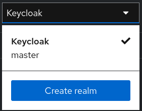
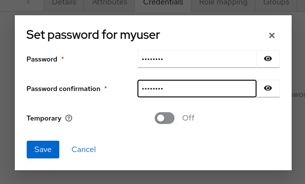
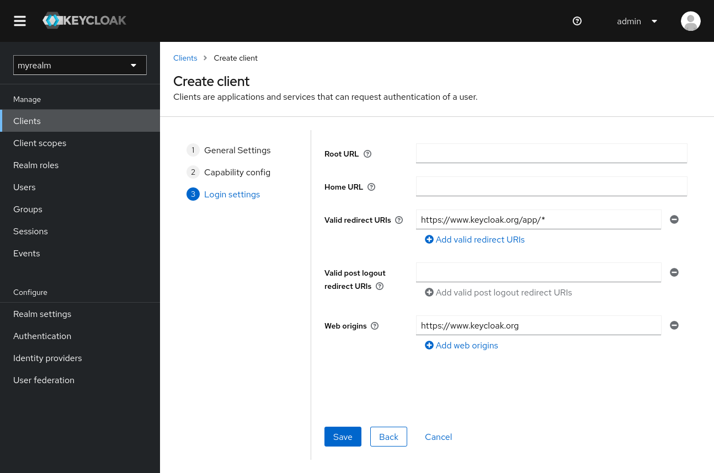

## [<<PREV](Part_04_Spring_Boot_Microservices_API_Gateway.md) - MICROSERVICE SECURITY - [NEXT>>](Part_06_Spring_Boot_Microservices_Resilience4J_Circuit_Breaker.md)

## Docker
Get started with Keycloak on Docker

### Before you start
Make sure your machine or container platform can provide sufficient memory and CPU for your desired usage of Keycloak. See Concepts for sizing CPU and memory resources for more on how to get started with production sizing.

Make sure you have Docker installed.

### Start Keycloak
From a terminal, enter the following command to start Keycloak:

docker run -p 8080:8080 -e KEYCLOAK_ADMIN=admin -e KEYCLOAK_ADMIN_PASSWORD=admin quay.io/keycloak/keycloak:25.0.1 start-dev
This command starts Keycloak exposed on the local port 8080 and creates an initial admin user with the username admin and password admin.

### Log in to the Admin Console
Go to the Keycloak Admin Console.

Log in with the username and password you created earlier.

### Create a realm
A realm in Keycloak is equivalent to a tenant. Each realm allows an administrator to create isolated groups of applications and users. Initially, Keycloak includes a single realm, called master. Use this realm only for managing Keycloak and not for managing any applications.

Use these steps to create the first realm.

Open the Keycloak Admin Console.

Click Keycloak next to master realm, then click Create Realm.

Enter myrealm in the Realm name field.

Click Create.

### Create a user
Initially, the realm has no users. Use these steps to create a user:

Verify that you are still in the myrealm realm, which is shown above the word Manage.

Click Users in the left-hand menu.

Click Add user.

Fill in the form with the following values:

Username: myuser

First name: any first name

Last name: any last name

Click Create.

This user needs a password to log in. To set the initial password:

Click Credentials at the top of the page.

Fill in the Set password form with a password.

Toggle Temporary to Off so that the user does not need to update this password at the first login.

### Log in to the Account Console
You can now log in to the Account Console to verify this user is configured correctly.

Open the Keycloak Account Console.

Log in with myuser and the password you created earlier.

As a user in the Account Console, you can manage your account including modifying your profile, adding two-factor authentication, and including identity provider accounts.

### Secure the first application
To secure the first application, you start by registering the application with your Keycloak instance:

Open the Keycloak Admin Console.

Click the word master in the top-left corner, then click myrealm.

Click Clients.

Click Create client

Fill in the form with the following values:

Client type: OpenID Connect

Client ID: myclient

Click Next

Confirm that Standard flow is enabled.

Click Next.

Make these changes under Login settings.

Set Valid redirect URIs to https://www.keycloak.org/app/*

Set Web origins to https://www.keycloak.org

Click Save.

To confirm the client was created successfully, you can use the SPA testing application on the Keycloak website.

Open https://www.keycloak.org/app/.

Click Save to use the default configuration.

Click Sign in to authenticate to this application using the Keycloak server you started earlier.

### Taking the next step
Before you run Keycloak in production, consider the following actions:

Switch to a production ready database such as PostgreSQL.

Configure SSL with your own certificates.

Switch the admin password to a more secure password.

For more information, see the server guides.
